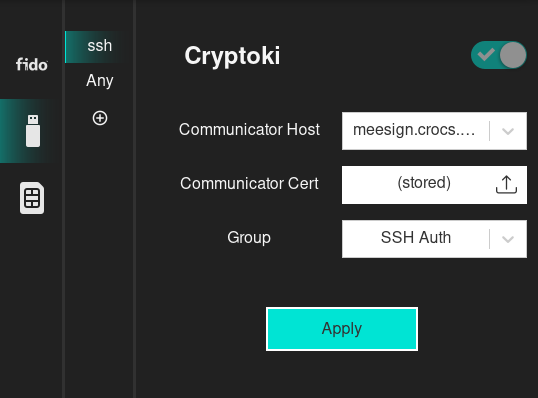

# Bridge Controller

Bridge Controller is the central application that provides means to customize and configure other services (emulated interfaces), using a GUI.

<figure markdown="span">
  { width="500" }
</figure>
