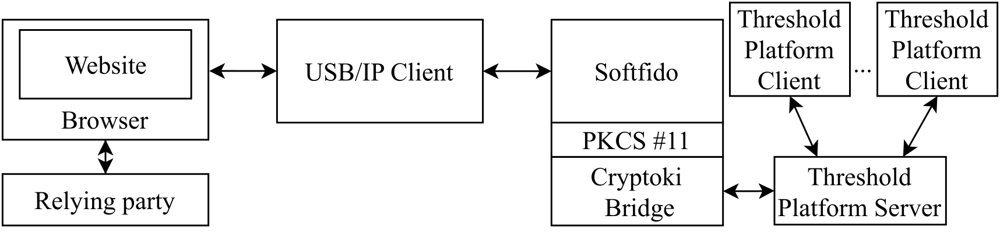

# FIDO Bridge

Fido Bridge emulates a FIDO2 token that supports both WebAuthn, and U2F. The tool itself was originally developed by [Helmut Eller](https://github.com/ellerh) under the name [Softfido](https://github.com/ellerh/softfido).

<figure markdown="span">
  { width="700" }
</figure>
